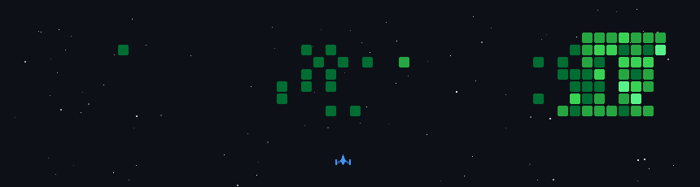

# 💫 Hi 👋, I'm Rishab 
**A passionate Full Stack Developer || Java Developer || Mobile App Developer**

Email Me 👉 ✉️ **rishabdanii@gmail.com** For Collaboration/Project or Anything Else. 😊😅
- 🔭 **I’m currently working on:** retail-shop-digitalization          
- 🌱 **I’m currently learning:** Spring Boot and flutter
- 👯 **I’m looking to collaborate on:** retail-shop-digitalization 
- 🤔 **I’m looking for help with:** Full Stack Job
- 💬 **Ask me about:** Collaboration, Tech Support
- 📫 **How to reach me:** rishabdanii@gmail.com
- 😄 **Pronouns:** Rishi
- ⚡ **Fun fact:** I Love Tech and Tech Love Me 
  
# 🌐 Socials:

 
 

    
  

  

# 💻 Tech Stack:

  
  
  
  
  
  
  
  
  
  
  
  
  
  
  
  
  
  
  
  
  
  
  
  
  
  
  
  
  
  
  
  
  
  
  
  
  
  
  
  
  
  
  
  
  
  
  
  
  
  
  

# 🚀 My GitHub Space Shooter:

  

# 🐍 Snake Game Repo View:

<picture>
  <source media="(prefers-color-scheme: dark)" srcset="https://raw.githubusercontent.com/Rishab-Dani/Rishab-Dani/output/github-snake-dark.svg">
<!--  <source media="(prefers-color-scheme: light)" srcset="https://raw.githubusercontent.com/Rishab-Dani/<repo-name>/output/github-snake.svg"> -->
  
</picture>

# 🏓Pong Game Repo View:

<picture>
   <source media="(prefers-color-scheme: dark)" srcset="https://raw.githubusercontent.com/Rishab-Dani/Rishab-Dani/main/assets/breakout-dark.svg/dark.svg">
  <!-- <source media="(prefers-color-scheme: light)" srcset="https://raw.githubusercontent.com/Rishab-Dani/Rishab-Dani/main/assets/breakout-dark.svg/light.svg" /> -->
   
</picture>

# 🏙️ GitHub Skyline (3D Contributions)

  
[View Interactive 3D Model](assets/skyline.stl)

# 👾 Pacman Game

<picture>
  <source media="(prefers-color-scheme: dark)" srcset="https://raw.githubusercontent.com/Rishab-Dani/Rishab-Dani/pacman/pacman-contribution-graph-dark.svg">
 <!-- <source media="(prefers-color-scheme: light)" srcset="https://raw.githubusercontent.com/Rishab-Dani/Rishab-Dani/output/pacman-contribution-graph.svg"> -->
  
</picture>

  

# 📊 GitHub Stats:

<!--

<picture>
  <source
    srcset="https://github-readme-stats.vercel.app/api?username=Rishab-Dani&show_icons=true&theme=dark"
    media="(prefers-color-scheme: dark)"
  />
 <source
    srcset="https://github-readme-stats.vercel.app/api?username=Rishab-Dani&show_icons=true"
    media="(prefers-color-scheme: light), (prefers-color-scheme: no-preference)"
  />
    
</picture>

 <source
    srcset="https://github-readme-stats.vercel.app/api?username=Rishab-Dani&show_icons=true&theme=dark"
    media="(prefers-color-scheme: dark)"
  />
<source
    srcset="https://github-readme-stats.vercel.app/api?username=Rishab-Dani&show_icons=true"
    media="(prefers-color-scheme: light), (prefers-color-scheme: no-preference)"
  />
   

 -->

 

 

# 📈 Language Mix

# 🚴🏻‍♂️ Activity-Graph:

  

# 🏆 GitHub Trophies
 

# ✍️ Random Dev Quote

# 🔝 Top Contributed Repo

---
<!-- Proudly created with GPRM ( https://gprm.itsvg.in ) -->
